<h1 align="center">Fret</h1>

<p align="center">
  A self-hosted replacement for WeTransfer.<br>
  Drop files, get a link, hand it over.
</p>

<p align="center">
  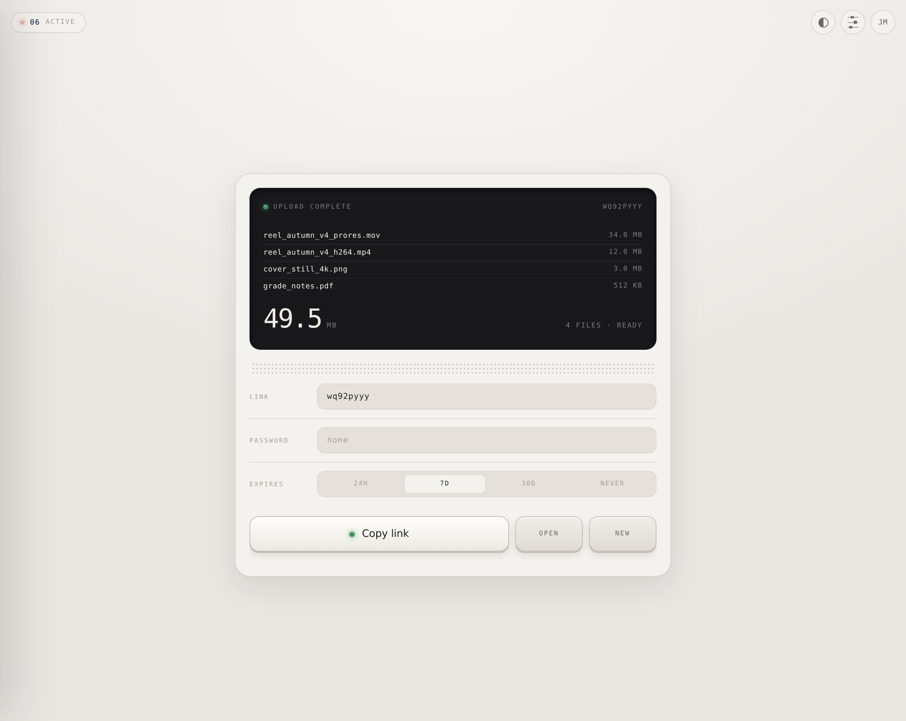
</p>

---

Fret is a small, fast file transfer service you run yourself. It signs people
in through your own identity provider, keeps files in your own S3 bucket, and
gets out of the way. There are no accounts to create, no plans, no size cap,
and nothing between the browser and your storage.

It was built for a film studio moving rushes and cuts to clients, and it is
useful anywhere a large file has to reach someone who should not have to sign
up for anything.

**What it does**

- **Drop-first.** Selecting files starts the upload immediately. The interface
  then grows to reveal the transfer's settings while bytes are still moving,
  so nothing has to be decided before the transfer begins.
- **Nothing to save.** Settings apply as you make them. There is no save
  button, and no way to lose a change by forgetting to press one.
- **Straight to storage.** Uploads and single-file downloads go browser ↔ S3
  directly over presigned URLs. The server issues the URLs and never carries
  the bytes, so a 100 GB transfer runs at your storage's own speed.
- **Resumable.** Every part that lands is recorded. An upload interrupted at
  80 % picks up from where it stopped rather than starting over.
- **No size cap.** Not "generous limits" — none. What your bucket holds, Fret
  will send.
- **Sign-in only, never sign-up.** OIDC against your provider. Fret stores no
  passwords and creates no accounts.
- **Expiring links,** with optional per-transfer passwords. Expired transfers
  are deleted from storage, not merely hidden.
- **One container.** A single static binary with the interface compiled in,
  plus SQLite on a volume. No database server, no asset directory, no runtime.

---

## Contents

- [How it looks](#how-it-looks)
- [Quick start](#quick-start)
- [Configuration](#configuration)
- [Storage setup](#storage-setup)
- [Identity provider setup](#identity-provider-setup)
- [How it works](#how-it-works)
- [Development](#development)
- [Limits and deliberate omissions](#limits-and-deliberate-omissions)

---

## How it looks

Every screenshot below is captured from the running application by
[`web/scripts/screenshots.mjs`](web/scripts/screenshots.mjs). None of them are
mockups.

### Signing in

One control, and no way to create an account. Your identity provider owns every
credential; Fret only learns who arrived.

<p align="center">
  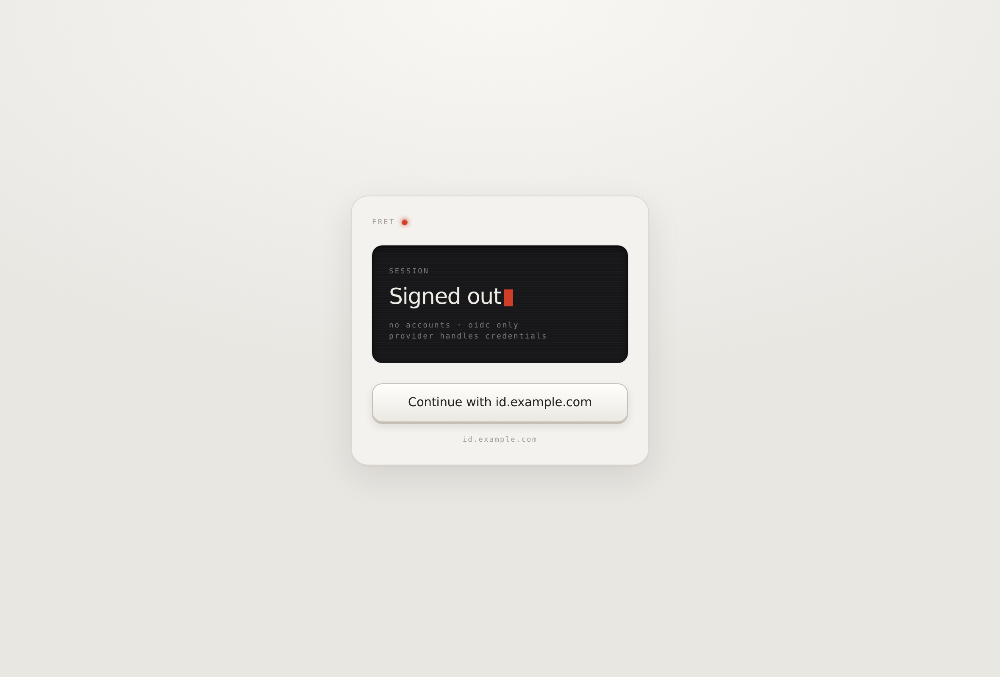
</p>

### Waiting for files

The whole screen is the drop target, and it is also click-to-browse. There is
no button and no explanatory copy, because there is only one thing to do.

<p align="center">
  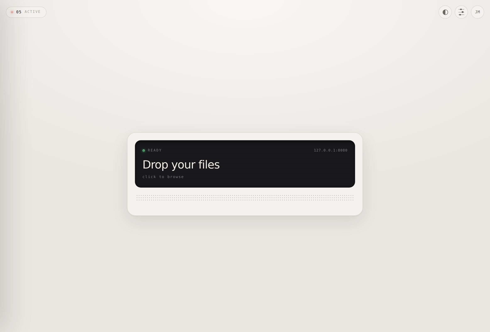
  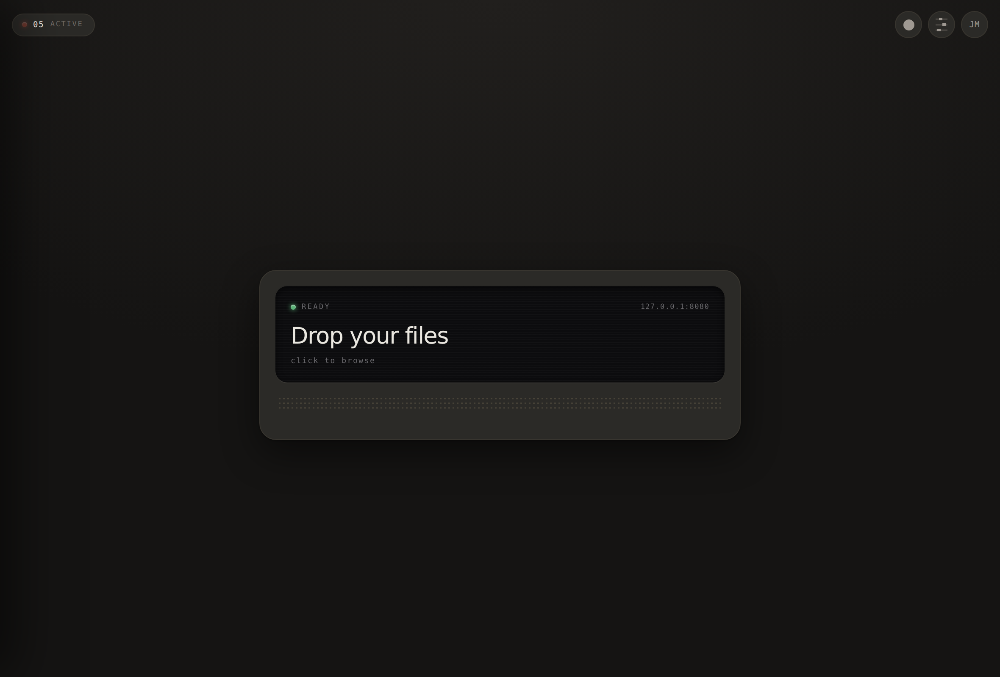
</p>

### Uploading

Progress is a rising material rather than a bar, with a bright meniscus at its
surface. The link, password and expiry are all editable while the transfer is
still running, and nothing needs saving: discrete choices apply on the spot,
and the text fields commit when you leave them.

<p align="center">
  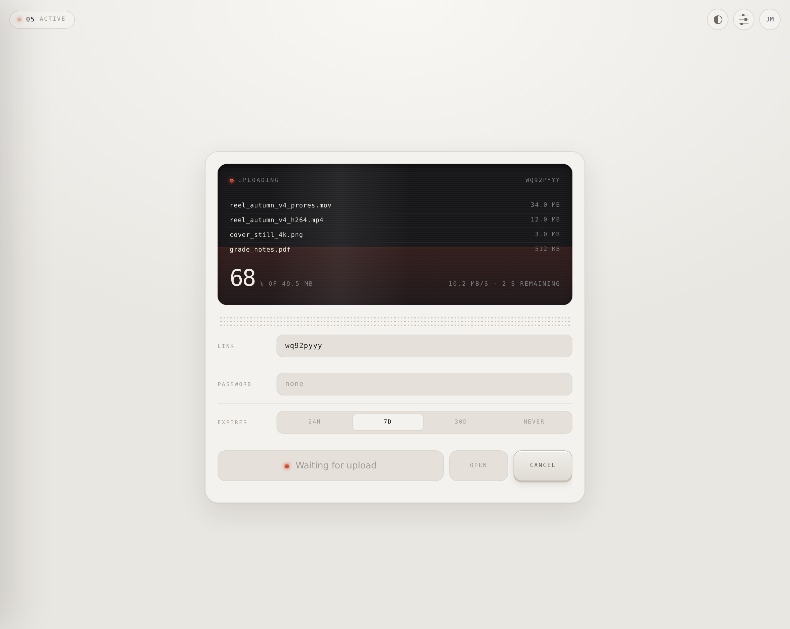
</p>

### Ready to share

On completion the material drains away, the lamp turns green, and the key
unlocks to copy the link. Not before: the link is not shareable until the bytes
have actually landed.

<p align="center">
  
</p>

### Renaming a link you already sent

Renaming a live transfer kills the old link — which is the point, since you
usually rename precisely because it went to the wrong person. But the old name
is not lost: it stays reserved to that transfer, and a paper tag slides out
from under the device offering it back.

<p align="center">
  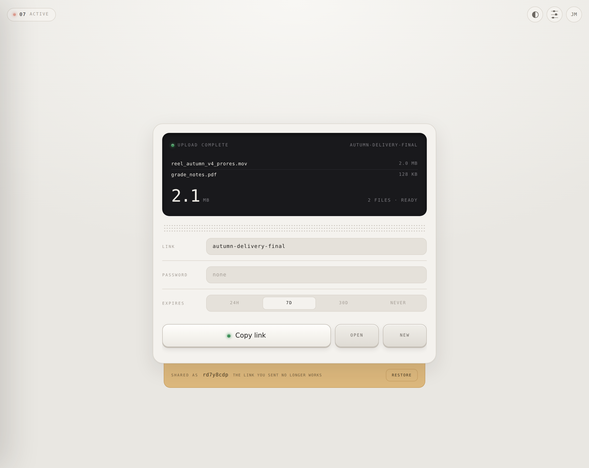
</p>

### Your transfers

One flat chronological list, deliberately ungrouped — the red countdown already
carries urgency, and an "expiring soon" section would break the history reading
that makes the list scannable. Tapping a row reveals copy, edit, open and
delete.

<p align="center">
  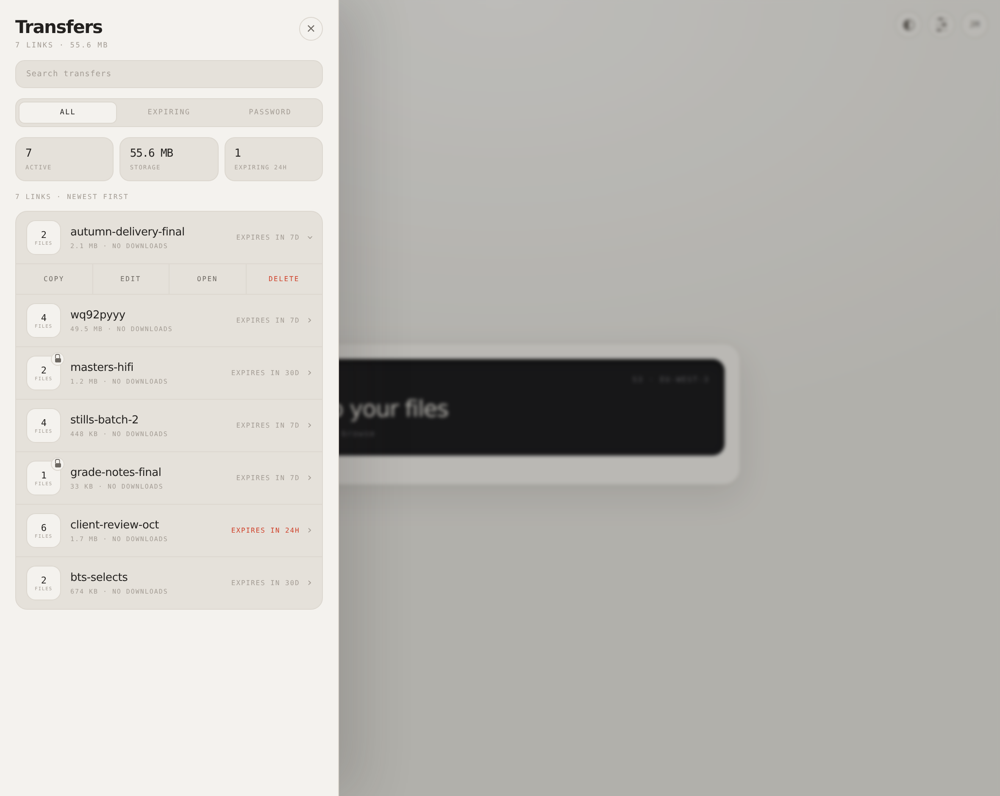
</p>

<p align="center">
  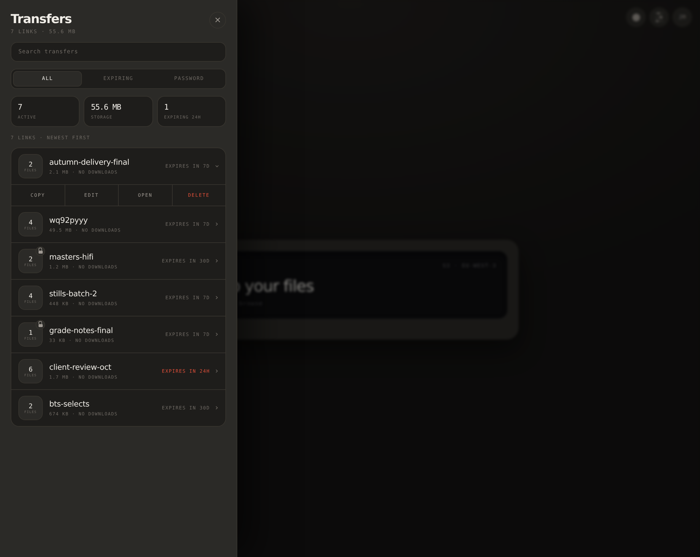
</p>

### Editing

Editing never loads a transfer back into the upload interface — it opens its
own modal. A saved password is never sent back to the browser, so the field
shows a placeholder rather than the stored value.

<p align="center">
  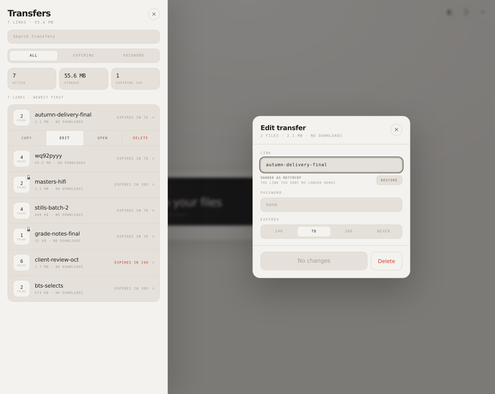
</p>

### Settings

Theme, link style and length, and default expiry are stored against the account
rather than the browser, so they follow you between devices. If you are the
instance's superadmin, bucket-wide usage appears here too.

<p align="center">
  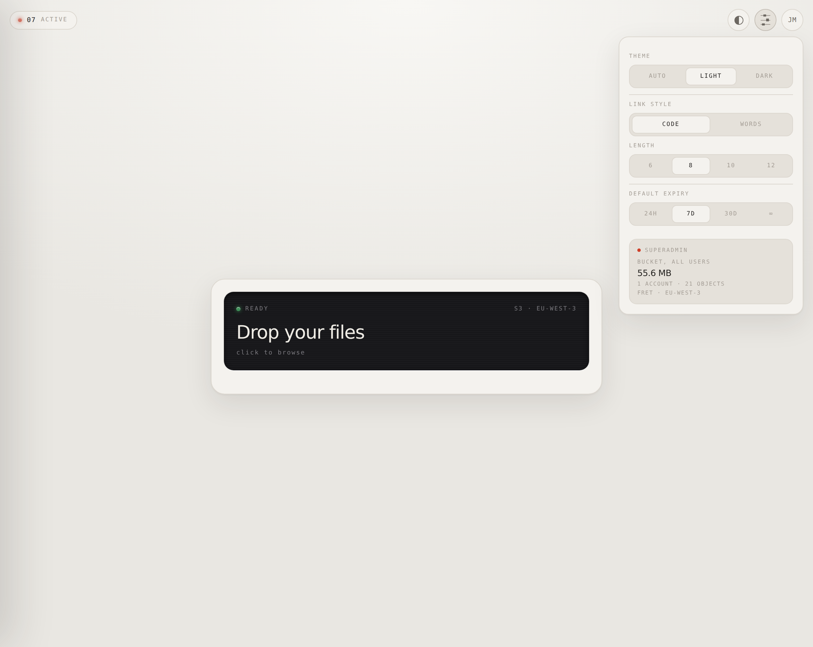
</p>

### What the recipient sees

No account, no sign-up, no upsell. Individual files download straight from
storage; **Download all** streams a zip assembled on the fly.

<p align="center">
  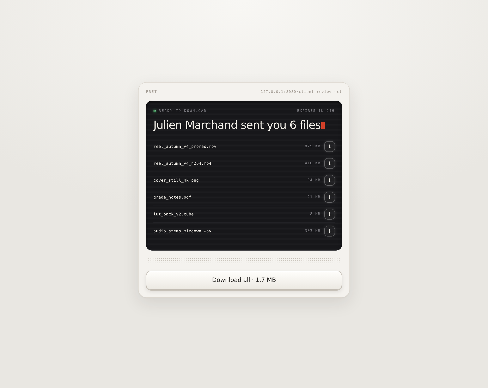
</p>

A password-protected transfer gives nothing away before it is unlocked — not
the filenames, not the size, not the sender.

<p align="center">
  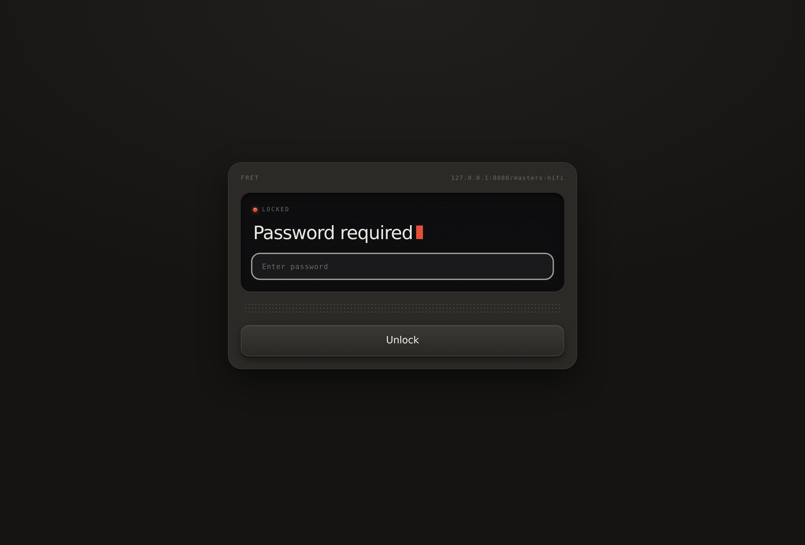
</p>

### On a phone

The sheet arrives from the bottom with a grab handle instead of a close button,
because that is what a thumb reaches for.

<p align="center">
  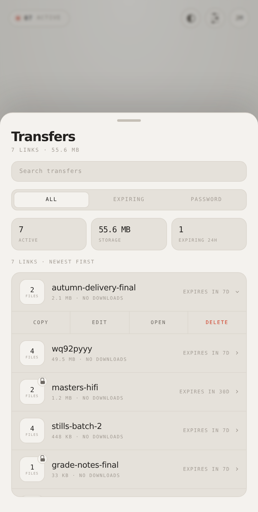
</p>

---

## Quick start

### See it first

To look around before configuring anything, run the demo. It starts Fret with
in-memory storage, a signed-in account and some seeded transfers — no S3, no
identity provider, nothing persisted.

```sh
git clone https://github.com/collinesfilms/Fret.git
cd Fret/web && npm install && npm run build && cd ..
go run ./cmd/fret-demo
```

Then open <http://127.0.0.1:8080/demo-login>.

> The demo skips authentication entirely. It is a local development tool and
> must never be exposed to a network you do not control.

### Deploy it

```sh
curl -O https://raw.githubusercontent.com/collinesfilms/Fret/main/docker-compose.yml
curl -o .env https://raw.githubusercontent.com/collinesfilms/Fret/main/.env.example

# Fill in the blanks — at minimum the session secret, S3 credentials and OIDC.
openssl rand -hex 32   # for FRET_SESSION_SECRET
$EDITOR .env

docker compose up -d
```

The supplied compose file brings its own MinIO. If you already run
S3-compatible storage, delete the `minio` services and point `FRET_S3_*` at
what you have.

Images are published to `ghcr.io/collinesfilms/fret` for every tagged release,
for `linux/amd64` and `linux/arm64`. To build from source instead, replace the
`image:` line with `build: .`.

Put a reverse proxy in front for TLS. Fret speaks plain HTTP and reads
`X-Forwarded-For`.

---

## Configuration

Everything is environment variables; see [`.env.example`](.env.example) for the
annotated set. The ones worth understanding:

| Variable | Default | Notes |
| --- | --- | --- |
| `FRET_APP_NAME` | `Fret` | Shown in the interface and the browser tab. Rename it freely. |
| `FRET_PUBLIC_URL` | — | The origin recipients see. Used to build share links and the default OIDC redirect. |
| `FRET_LOCALE` | `en` | `en` or `fr`. Instance-wide. |
| `FRET_SESSION_SECRET` | — | **Required.** 32+ random bytes. Fret refuses to start without it. |
| `FRET_S3_PUBLIC_ENDPOINT` | — | The storage address **the browser** can reach. |
| `FRET_S3_INTERNAL_ENDPOINT` | = public | The storage address **the server** uses. See below. |
| `FRET_S3_BUCKET` | — | Fret's bucket. It expects to own it. |
| `FRET_S3_FORCE_PATH_STYLE` | `true` | Keep for MinIO and most self-hosted gateways; set `false` for AWS S3. |
| `FRET_OIDC_ISSUER` | — | Your provider's issuer URL. Discovery is automatic. |
| `FRET_SUPERADMIN` | — | One OIDC subject or email address, allowed to see bucket-wide usage. |
| `FRET_PRESIGN_DOWNLOAD_TTL` | `15m` | How long a download URL stays valid once issued. |
| `FRET_ORPHAN_MAX_AGE` | `24h` | An upload idle this long is abandoned and its storage reclaimed. |

### Why there are two S3 endpoints

Fret signs browser-facing URLs against `FRET_S3_PUBLIC_ENDPOINT` and makes its
own requests to `FRET_S3_INTERNAL_ENDPOINT`. With MinIO on a NAS these are
usually different addresses for the same bucket:

```
FRET_S3_PUBLIC_ENDPOINT=https://s3.yourdomain.com   # browsers upload and download here
FRET_S3_INTERNAL_ENDPOINT=http://10.0.0.4:9000      # the server reads over the LAN
```

The public one **must** be reachable from your users' browsers, because that is
where the bytes actually go. The internal one saves a round trip out through
your reverse proxy and back when Fret assembles an archive. On a managed
provider they are the same — set only the public one.

---

## Storage setup

Fret needs a bucket and a key pair with read, write, delete and multipart
permissions on it. Two settings matter beyond that.

### CORS

The browser uploads directly to your bucket, so the bucket must allow it — and
must **expose the `ETag` header**. Multipart uploads cannot be assembled
without it, and its absence is the single most common way a Fret install fails.
Fret detects this specific case and says so in the error rather than leaving
you to guess.

**MinIO** permits all origins by default and already exposes `ETag`, so there
is nothing to do unless you have narrowed it. To narrow it:

```sh
# As an environment variable on the MinIO server
MINIO_API_CORS_ALLOW_ORIGIN=https://fret.yourdomain.com
```

**AWS S3 and most others** need an explicit policy:

```json
[
  {
    "AllowedOrigins": ["https://fret.yourdomain.com"],
    "AllowedMethods": ["GET", "PUT", "HEAD"],
    "AllowedHeaders": ["*"],
    "ExposeHeaders": ["ETag"],
    "MaxAgeSeconds": 3000
  }
]
```

### Lifecycle rules

You do not need any. Fret's own sweeper deletes expired transfers and aborts
multipart uploads that outlive the transfer they belonged to. A belt-and-braces
lifecycle rule aborting incomplete multipart uploads after 7 days does no harm
and will catch anything Fret misses if it is down for a long stretch.

---

## Identity provider setup

Fret uses the OIDC authorization code flow with PKCE. Any compliant provider
works — [Pocket ID](https://github.com/pocket-id/pocket-id), Authentik,
Keycloak, Authelia, Zitadel, Okta, Google.

Register Fret as a **confidential client** with:

- **Redirect URI** — `https://fret.yourdomain.com/auth/callback`
- **Scopes** — `openid profile email`
- **Grant type** — authorization code

Then set `FRET_OIDC_ISSUER`, `FRET_OIDC_CLIENT_ID` and
`FRET_OIDC_CLIENT_SECRET`.

**Anyone your provider admits can send files.** Fret has no user management of
its own by design — restricting who may sign in is your provider's job, which
it does better than a bespoke system would. An account row appears the first
time someone signs in successfully.

`FRET_SUPERADMIN` takes one OIDC subject or email address and grants exactly
one extra thing: visibility of bucket-wide usage. It is resolved server-side
and a client can never claim it.

---

## How it works

### Uploads

```
browser ──── PUT part ────────────────────────────▶  S3
   │                                                  ▲
   └──── "part 7 landed, etag abc" ──▶  Fret  ────────┘
                                        (issues presigned URLs,
                                         records what arrived)
```

Files are cut into parts and PUT straight to storage over presigned URLs, four
at a time, with retries and backoff. Fret hands out the URLs and records each
part as it lands; the bytes never pass through it. Part size scales with file
size so even a multi-terabyte file stays under S3's 10,000-part limit.

The slug is minted before the first byte moves, which is what lets you edit it
mid-transfer — but it is reserved and inert. It only starts resolving when the
upload completes. That is why the copy button stays locked until then: the link
genuinely does not work yet.

### Resuming

Every completed part is recorded, so an interrupted upload knows exactly what
is already in the bucket.

One honest limitation: a page reload destroys the browser's `File` handles, and
no web application can read your files back without you pointing at them again.
So resuming asks you to re-select the same files. Fret matches them by name and
size, and uploads only the gaps — you re-select 80 GB, you do not re-send it.

### Downloads

A single file is a redirect to a presigned URL. Fret decides whether you may
have it, then steps out of the way.

**Download all** streams a zip built on the fly — nothing is pre-zipped,
nothing is written to disk, and memory stays flat regardless of size. Entries
are *stored* rather than compressed, which is the right call for finished media
that will not compress anyway, and it has a useful consequence: the exact size
of the archive is computable in advance. The response carries a real
`Content-Length`, so the recipient gets a true progress bar and an ETA instead
of an indefinite spinner. Zip framing costs around 21 GB/s on ordinary
hardware, so the only real constraint is your server's bandwidth.

### Passwords

Optional, per transfer, hashed with argon2id. A locked transfer reveals nothing
before unlock — filenames say a great deal about a delivery, so they are part
of what the password protects. Attempts are throttled per client and transfer.

A password protects the *page*, not the bytes in flight: once you unlock and
Fret issues a presigned URL, that URL works for its TTL
(`FRET_PRESIGN_DOWNLOAD_TTL`, 15 minutes by default) for anyone who has it.

### Expiry

The sweeper runs every `FRET_SWEEP_INTERVAL` and deletes expired transfers from
storage as well as the database, so your bucket does not grow forever. It also
discards uploads abandoned mid-flight and aborts orphaned multipart uploads —
parts that would otherwise sit in the bucket invisible to any object listing
and billed all the same.

### What is stored where

**SQLite** holds bookkeeping only: accounts and their preferences, transfers,
slugs, password hashes, download counts and the part ledger. It is small and
stays small. **S3** holds every byte of every file. Back up the SQLite file;
without it the objects are still there but nothing knows what they are.

---

## Development

Requirements: Go 1.25+, Node 22+.

```sh
# Terminal 1 — the API and a fake in-memory S3, with seeded data
go run ./cmd/fret-demo

# Terminal 2 — the frontend with hot reload, proxying to the above
cd web && npm run dev
```

Work against <http://localhost:5173>, which serves the frontend live.
`cmd/fret-demo` serves the copy of the frontend that was compiled into it, so
after a frontend change it needs `npm run build` and a restart to catch up —
worth knowing before you go looking for a bug that is really a stale asset.

```sh
go test ./...          # includes an end-to-end suite against an in-process S3
cd web && npm run build && cd ..
go build ./cmd/fret    # single binary with the interface embedded
```

### Layout

```
cmd/fret            the server
cmd/fret-demo       local preview: in-memory S3, seeded data, no auth
internal/api        HTTP handlers, routing, the embedded frontend
internal/auth       OIDC with PKCE, sessions, argon2id
internal/storage    S3: presigning, multipart, orphan cleanup
internal/zipstream  the streaming zip writer
internal/sweeper    expiry and reclamation
internal/db         SQLite schema and queries
web/                React + TypeScript frontend
```

### Refreshing the screenshots

```sh
go run ./cmd/fret-demo          # terminal 1
cd web && npm run screenshots   # terminal 2
```

---

## Limits and deliberate omissions

Things Fret does not do, and why:

- **No email.** Fret does not notify recipients. You copy a link and send it
  however you already talk to people.
- **No folder structure.** Dropped folders are flattened. If the structure
  matters, send an archive.
- **No user management.** Your identity provider does this.
- **One instance at a time.** SQLite means one writer, which is the right
  trade for a service whose heavy lifting happens in S3. If you need replicas,
  the storage layer is abstracted enough to swap.
- **No second short domain — yet.** Host handling is not hardcoded, so adding
  one is configuration rather than a rewrite.
- **2,000 files per transfer.** Not a size limit — a bound on how much work one
  request can create. Send an archive if you genuinely have more.

## License

MIT. See [LICENSE](LICENSE).
